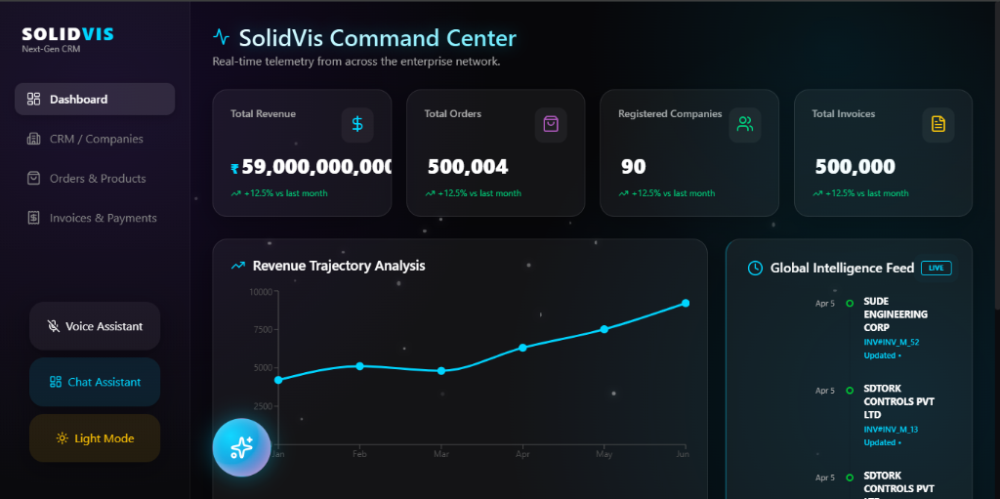
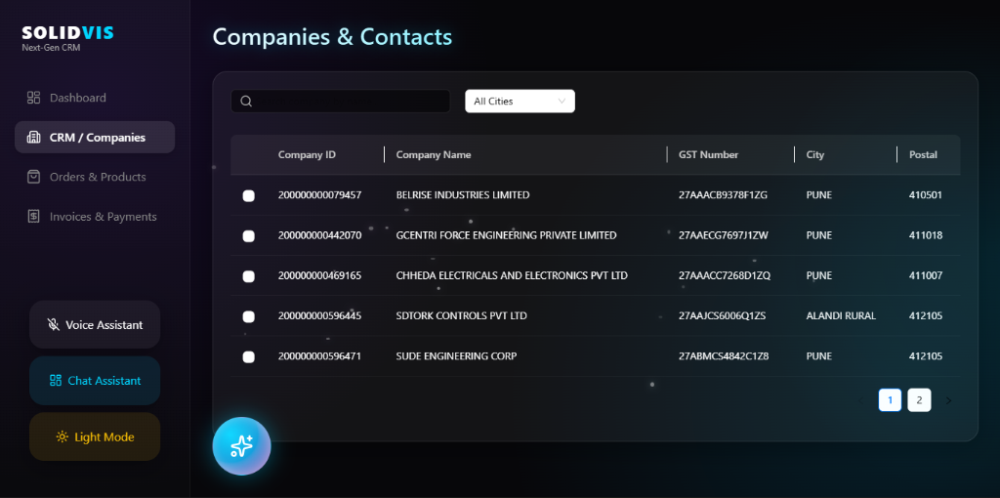
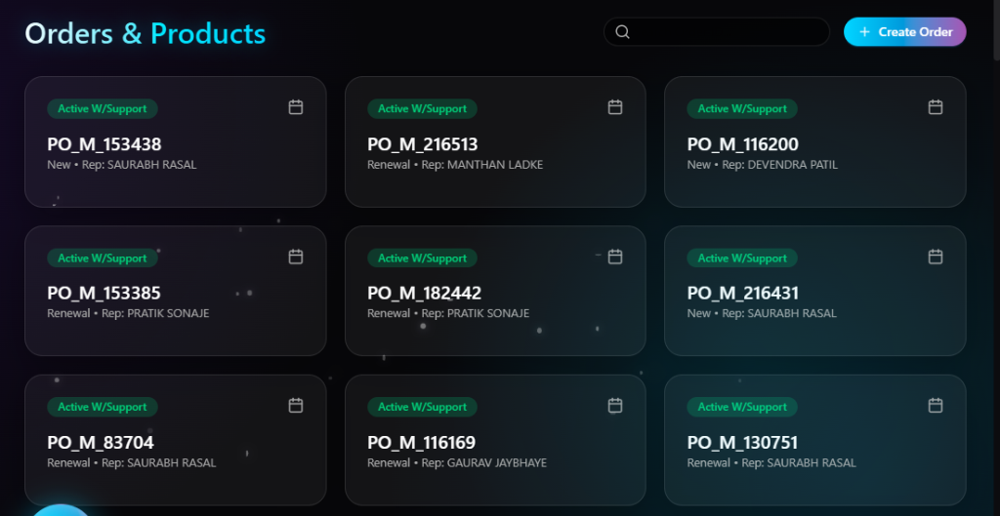
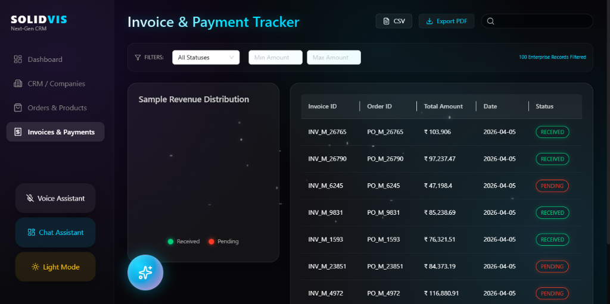

# 🚀 SolidVis CRM: Real-Time Enterprise B2B Platform

🔗 **Live Demo:** https://solidvis-crm-platform.vercel.app
📦 **GitHub:** https://github.com/SOUMILCHANDRA/Solidvis-CRM-Platform


> **A production-ready CRM platform designed for handling large-scale datasets (500k+ records) with real-time synchronization and sub-second query performance.**

---

## 🚀 Overview

SolidVis is a **full-stack CRM system** built to manage customer relationships, sales pipelines, and financial tracking with real-time updates.

It focuses on **performance, scalability, and responsiveness**, ensuring smooth operation even with large datasets.

---

## 🖼️ Platform Showcase

| 🖥️ Dashboard                             | 🏢 Companies                              |
| ----------------------------------------- | ----------------------------------------- |
|  |  |

| 📦 Orders                           | 🧾 Invoices                                |
| ----------------------------------- | ------------------------------------------ |
|  |  |

---

## 🏗️ Architecture

**User → React (Vite) → Supabase SDK → PostgreSQL**

* Real-time updates via WebSockets (Supabase Realtime)
* Indexed PostgreSQL database for fast queries
* Secure authentication using Supabase Auth

---

## ⚙️ Performance & Optimization

* **Indexed Queries (B-Tree)** → Reduced lookup complexity to `O(log N)`
* **Planned Counts** → Instant large dataset pagination
* **Debounced Search (500ms)** → Prevents API overload
* **Optimized Joins** → Multi-table queries in a single request

---

## 🧠 Key Features

* 📇 Customer & company management
* 👥 **Team Management**: Dedicated module to manage enterprise sales representatives.
* 📊 Sales and order tracking
* ⚡ Real-time updates across users
* 📈 Financial monitoring (invoices & revenue)
* 🔍 High-performance filtering on large datasets
* 🛡️ **Transaction Console**: Integrated UI for real-time testing of database atomicity.

---

## 📊 Scale & Capability

* Handles **500k+ records efficiently**
* Maintains **sub-second response times**
* Supports complex relational queries

---

## ⚠️ Engineering Challenges

* Optimizing multi-table joins without performance loss
* Handling large datasets without UI lag
* Preventing unnecessary React re-renders

---

## 🚀 Future Improvements

* Role-based access control (RBAC)
* ML-based revenue forecasting
* Multi-tenant architecture
* Mobile application

---

## 📦 Installation

```bash
git clone https://github.com/SOUMILCHANDRA/Solidvis-CRM-Platform
cd Solidvis-CRM-Platform
npm install
npm run dev
```

---

## 👤 Author

Soumil Chandra
Full Stack & Data Visualization Engineer

---

## 📚 DBMS Academic Extension

This project includes a comprehensive academic extension exploring advanced database management system concepts:
- **Transaction Management**: Real-world implementation using PostgreSQL (Supabase RPC) with full ACID compliance and rollback handling, accessible via the **Txn Console** in the app.
- **Serializability**: Theoretical and practical analysis of Conflict and View Serializability in concurrent systems.
- **NoSQL Integration**: MongoDB schema design patterns (Embedding vs. Referencing) and complex aggregation queries.
- **Paradigm Comparison**: Detailed trade-off analysis between SQL (PostgreSQL) and NoSQL (MongoDB).
- **Core Feature**: Integrated **Team Management** module for sales force automation.

📂 **Detailed Documentation & Implementation artifacts can be found in [/docs/dbms](./docs/dbms)**

---

*Built for high-stakes enterprise B2B by SolidVis Engineering.*
