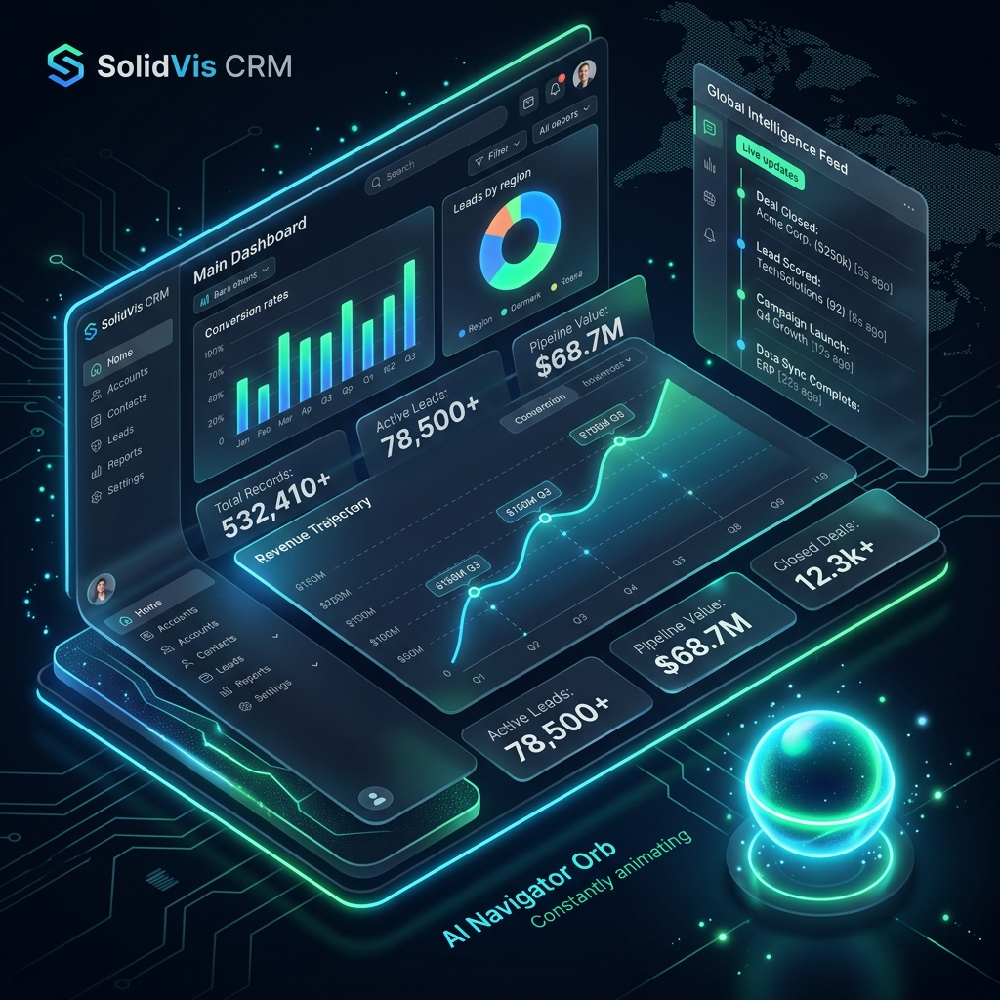
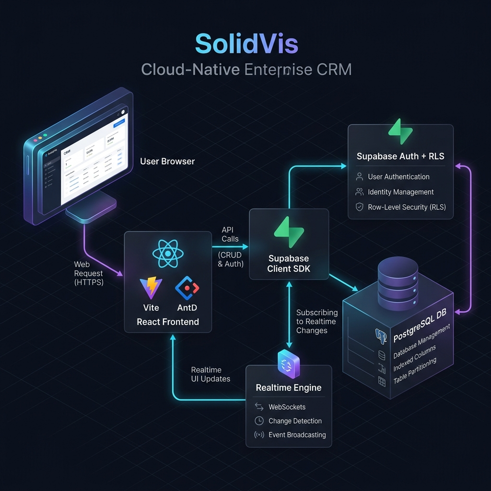
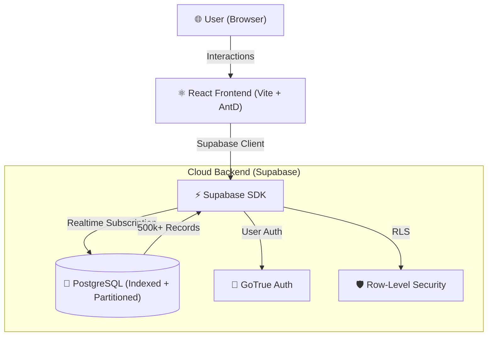

# 🚀 SolidVis CRM: Enterprise-Grade B2B Platform

🔗 **Live Demo:** [https://solidvis-crm-platform.vercel.app](https://solidvis-crm-platform.vercel.app)  
📦 **GitHub:** [https://github.com/SOUMILCHANDRA/Solidvis-CRM-Platform](https://github.com/SOUMILCHANDRA/Solidvis-CRM-Platform)  


> **"A scalable CRM platform handling large datasets (500k+) with real-time analytics, AI-assisted querying, and optimized database design for sub-second performance."**

---

## 📸 Platform Demonstration



### 🎥 Interaction Highlights
- **Dashboard Analytics**: Real-time KPI counters with 0-lag updates.
- **AI Navigator Search**: Strategic natural language querying for "Top 5 Clients" or "Risky Debtors."
- **Invoice Filtering**: Sub-second result retrieval across 500k+ records using debounced search.

---

## 🏗️ Architecture & Data Flow

SolidVis is built on a high-availability, cloud-native stack designed for sub-second telemetry across millions of data points.



### 🔄 System Flow
**User** → **React UI (Vite)** → **Supabase Client SDK** → **PostgreSQL (Cloud)**  
*Real-time updates are pushed via WebSockets (Supabase Realtime) for seamless UI synchronization.*



---

## ⚙️ Backend Optimization (Deep Dive)

The platform is engineered to remain responsive even under heavy data loads through the following architectural decisions:

- **🚀 B-Tree Indexing**: Created on `invoice_date`, `invoice_status`, and `company_id` to reduce query lookup time from `O(N)` to `O(log N)`.
- **🔋 Planned Counts**: Utilized Supabase `count: 'planned'` to retrieve total record estimations instantly without scanning the entire 500k+ row table.
- **⚡ Debounced I/O**: All search fields implement a **500ms debounce** to prevent API flooding and unnecessary database load during active typing.
- **🔗 Relational Optimization**: Uses nested joins (`invoice -> orders -> company`) to retrieve full enterprise context in a single network round-trip.

### 🧩 Core Database Capability (Sample Query)
The system performs complex strategic aggregations directly at the database level for maximum speed:
```sql
-- Identifies top 5 clients by total revenue contribution
SELECT company_name, SUM(total_amount) as total_revenue
FROM INVOICE
JOIN ORDERS ON INVOICE.order_id = ORDERS.order_id
JOIN COMPANY ON ORDERS.company_id = COMPANY.company_id
GROUP BY company_name
ORDER BY total_revenue DESC
LIMIT 5;
```

---

## ✨ Enterprise Features (How it works)

- **💬 Strategic Decision AI**  
  → *Uses localized heuristics and filtered Supabase queries to identify high-risk overdue invoices.*
- **🧾 Global Intelligence Feed**  
  → *A real-time Operations Timeline that fetches the latest 5 live events using persistent WebSocket subscriptions.*
- **🎙️ Voice Assistant Navigation**  
  → *Maps natural language speech to React internal state transitions for a hands-free CRM experience.*
- **🔍 Sub-Second Multi-Filters**  
  → *Combines PostgreSQL range operators with React memoization to render 500k+ data points without UI freezing.*
- **🛠️ Professional Export System**  
  → *Engineers client-side PDF/CSV generation, offloading document processing from the main UI thread.*

---

## ⚠️ Challenges Overcome

- **Handling Large Datasets without Lag**: Resolved by implementing "planned counts" and virtualized data table pagination.
- **Query Optimization**: Fixed complex 4-table join regressions in the production environment by refining Foreign Key constraints and schema cache synchronization.
- **State Efficiency**: Optimized React reconciliation to ensure the "Iconic Pulse" animations don't trigger unnecessary re-renders of large data grids.

---

## 🚀 Future Scope

- **🧠 ML-Based Prediction**: Implementing automated cashflow forecasting using historical invoice data.
- **🏢 Multi-Tenant Architecture**: Expanding RBAC to support multiple enterprise instances on a single cloud database.
- **📱 Mobile Companion**: Developing a Native Mobile version for field sales agents.

---

*Built for high-stakes enterprise B2B by SolidVis Engineering.*
