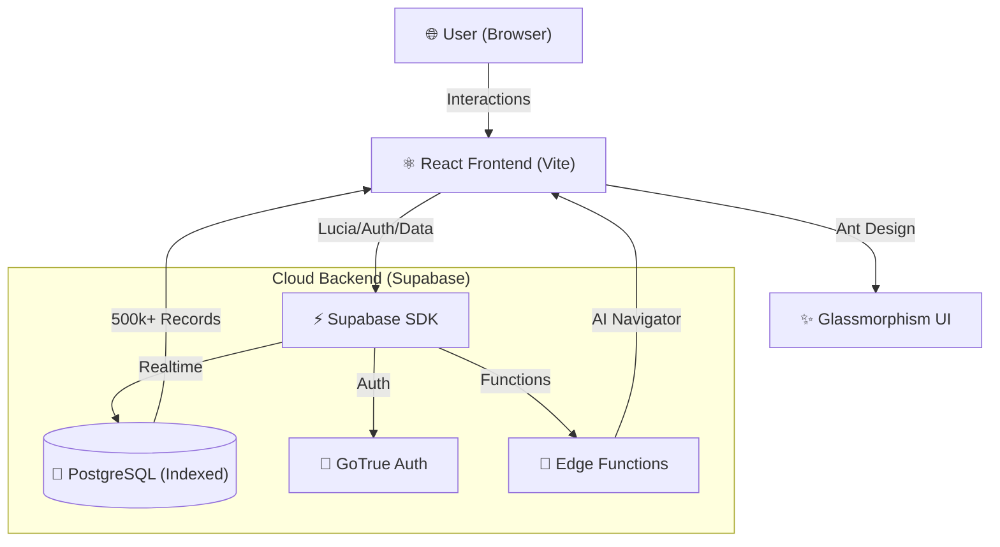

# 🚀 SolidVis CRM Platform

🔗 **Live Demo:** [https://solidvis-crm-platform.vercel.app](https://solidvis-crm-platform.vercel.app)  
📦 **GitHub:** [https://github.com/SOUMILCHANDRA/Solidvis-CRM-Platform](https://github.com/SOUMILCHANDRA/Solidvis-CRM-Platform)  


> **Next-Gen B2B Enterprise CRM** — Real-time cloud data, AI-controlled navigator, and enterprise order management for 500,000+ records.

---

---

## 🏗️ Architecture



---

## ⚡ Performance Highlights

- **🚀 Scalability**: Handles 500,000+ records efficiently with indexed queries.
- **⚡ Zero Lag**: Debounced search and optimized React rendering (0 lag UX).
- **🔋 Live Sync**: Instant UI updates via Supabase Realtime engine.
- **🧠 AI Smart**: Predictive stock alerts and natural language navigation.

---

## Features

- **🔐 Secure Authentication** — Supabase native auth with login/register gateway
- **📊 Live Dashboard** — Animated KPI counters, live payment status pie chart, order trajectory line chart
- **🏢 CRM / Companies** — Search and browse all registered client companies from cloud database
- **📦 Orders & Products** — Create orders with full product bifurcation, auto-linked pricing, and real-time total bill calculation
- **🧾 Invoices & Payments** — Browse 2M+ invoice records with debounced search, optimized for zero timeout
- **🎙️ Voice Assistant** — AI-powered voice navigation and search across all tabs
- **💬 AI Chat Navigator** — **Strategic Decision AI** that identifies "Risky Invoices," "Top 5 Clients," and performs revenue trajectory analysis via natural language through a relocated pulsing **AI Orb**
- **🧾 Global Intelligence Feed** — **Real-time Operations Timeline** that dynamically fetches and displays the latest invoice events, status updates, and enterprise actions from the Supabase cloud
- **🛠️ Advanced Export System** — Enterprise-ready **PDF report generation** and **CSV data portability** for all dashboard records
- **🔍 High-Performance Multi-Filters** — Deep-search 500,000+ records by **Status (Pending/Received)**, **Amount Range**, and **Date Range** with sub-second responsiveness
- **🔋 Optimized Telemetry** — Persistent, high-speed **Animated Counters** engineered for massive scale (incrementing 500k+ metrics in 1s)
- **🖱️ Reactive Mouse Aura** — Premium interactive background that tracks cursor movement
- **✨ Glassmorphism UI** — Premium dark-mode design with Framer Motion animations and **unobstructed visual hierarchy**

---

## Tech Stack

| Layer | Technology |
|---|---|
| Frontend | React 18, Vite, TypeScript |
| UI Library | Ant Design, Framer Motion, Lucide Icons |
| Charts | Recharts |
| Backend / Database | Supabase (PostgreSQL) |
| Auth | Supabase Native Auth |
| Hosting | Vercel |
| Styling | Vanilla CSS (Glassmorphism) |

---

## Getting Started

### Prerequisites
- Node.js 18+
- A Supabase project with the schema applied

### 1. Clone the repository
```bash
git clone https://github.com/SOUMILCHANDRA/Solidvis-CRM-Platform.git
cd Solidvis-CRM-Platform/frontend
```

### 2. Install dependencies
```bash
npm install
```

### 3. Configure environment variables

Create a `.env.local` file inside the `frontend/` folder:

```env
VITE_SUPABASE_URL=your_supabase_project_url
VITE_SUPABASE_ANON_KEY=your_supabase_anon_key
```

### 4. Run locally
```bash
npm run dev
```

The app will be available at `http://localhost:5173`

---

## Database Schema

Run the SQL files in the root of this repository against your Supabase project in this order:

1. `supabase_master_setup.sql` — Recommended master setup script (includes all tables + RBAC schema)
2. `supabase_inserts.sql` — Seed data inserts
3. `supabase_massive_data.sql` — Large-scale dummy data generation (~500k-2M records)

---

## Deployment

This project is deployed on **Vercel**. To deploy your own instance:

```bash
cd frontend
npx vercel
```

Make sure to add your `VITE_SUPABASE_URL` and `VITE_SUPABASE_ANON_KEY` in your Vercel project's **Environment Variables** settings before the final production build.

---

## Voice Assistant Commands

| Say | Action |
|---|---|
| *"Dashboard"* | Navigate to Dashboard |
| *"Orders"* | Navigate to Orders tab |
| *"Companies"* | Navigate to Companies tab |
| *"Invoices"* | Navigate to Invoices tab |
| *"Search for [term]"* | Auto-search in current tab |
| *"Find order [ID]"* | Navigate to Orders and search |
| *"Find client [name]"* | Navigate to Companies and search |
| *"Search invoice [ID]"* | Navigate to Invoices and search |
| *"Add order"* | Navigate to Orders and open New Order modal |

---

## Project Structure

```
Solidvis-CRM-Platform/
├── frontend/
│   ├── src/
│   │   ├── components/
│   │   │   ├── AuthView.tsx          # Login / Register screen
│   │   │   ├── DashboardView.tsx     # KPI charts & stats
│   │   │   ├── CompaniesView.tsx     # Client company browser
│   │   │   ├── OrdersView.tsx        # Orders + product bifurcation
│   │   │   ├── InvoicesView.tsx      # Invoice & payment tracker
│   │   │   ├── ChatAssistant.tsx     # AI Navigator chat interface
│   │   │   └── NotificationSystem.tsx # Live Intelligence Feed UI
│   │   ├── lib/
│   │   │   └── supabase.ts           # Supabase client init
│   │   ├── App.tsx                   # Main layout + voice assistant
│   │   └── index.css                 # Glassmorphism design system
│   └── index.html
├── supabase_master_setup.sql        # Master database schema script
├── supabase_inserts.sql             # Enterprise seed data
└── supabase_massive_data.sql        # Massive dummy data generator
```

---

## License

This project is proprietary software developed for internal enterprise use by **SolidVis**.

---

*Built with ❤️ using React, Supabase, and Vercel.*
